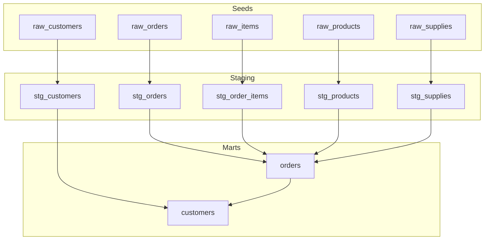
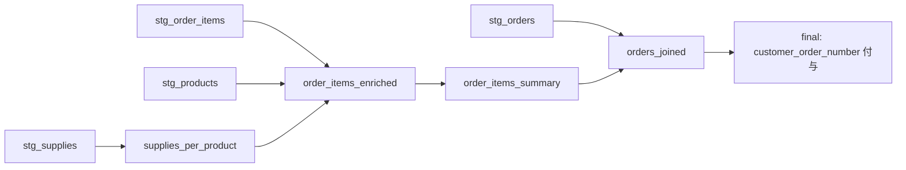
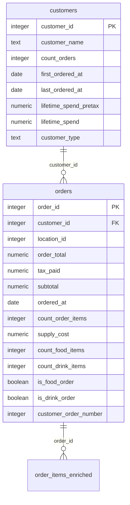

# Design Document: new-mart-model

## Overview

**Purpose**: staging レイヤーの生データを結合・集計し、データアナリストが直接利用できる分析用 mart テーブル（orders, customers）を提供する。

**Users**: データアナリストが注文パフォーマンス分析、顧客セグメンテーション、リテンション分析に利用する。

**Impact**: 空の `models/marts/` ディレクトリに2つの新規モデルと対応する YAML スキーマを追加する。既存コードへの変更なし。

### Goals
- 注文ごとのアイテム集計・原価・カテゴリフラグ・顧客内注文順序を含む orders テーブルを提供
- 顧客ごとの購買履歴集約・顧客タイプ判定を含む customers テーブルを提供
- 全モデルに PK テスト・FK テスト・YAML スキーマを定義し、`dbt build` で検証可能にする

### Non-Goals
- order_items, products, locations, supplies の mart モデル作成（将来スコープ）
- Semantic Layer / MetricFlow 定義の追加
- 既存 staging モデルの変更

## Architecture

### Architecture Pattern & Boundary Map

**Architecture Integration**:
- **Selected pattern**: レイヤードデータ変換（seeds → staging → marts）。既存パターンの自然な延長
- **Domain boundaries**: orders は注文ドメイン、customers は顧客ドメイン。customers は orders mart に依存
- **Existing patterns preserved**: CTE チェーン、`ref()` による疎結合、YAML スキーマ定義
- **New components rationale**: marts ディレクトリは空であり、全て新規作成
- **Steering compliance**: structure.md の「上方向参照のみ」「集計の遅延（staging では raw 粒度維持、集計は marts で）」に準拠

### Technology Stack

| Layer | Choice / Version | Role in Feature | Notes |
|-------|------------------|-----------------|-------|
| Data / Storage | DuckDB | mart テーブルの永続化先 | dbt_project.yml の profile で設定済み |
| Framework | dbt-core >= 1.5.0 | モデル実行・テスト・DAG 管理 | 既存バージョン要件に準拠 |
| Packages | dbt_utils 1.3.3 | テスト用ユーティリティ（expression_is_true 等） | 既にインストール済み |

## System Flows

### データ変換フロー（orders モデル）

**Key Decisions**:
- stg_supplies を product_id 単位で事前集計（`supplies_per_product` CTE）してから order_items と結合。行膨張を防止
- customer_order_number は最終 CTE で `ROW_NUMBER()` window 関数を適用

## Requirements Traceability

| Requirement | Summary | Components | Files |
|-------------|---------|------------|-------|
| 1.1 | stg_orders, stg_order_items, stg_products, stg_supplies の結合 | orders model | orders.sql |
| 1.2 | アイテム数、原価合計、食品数、飲料数の集計 | orders model — order_items_summary CTE | orders.sql |
| 1.3 | is_food_order, is_drink_order フラグ | orders model — order_items_summary CTE | orders.sql |
| 1.4 | customer_order_number（顧客内注文連番） | orders model — final CTE | orders.sql |
| 1.5 | subtotal, tax_paid, order_total のドル単位提供 | orders model — stg_orders から引き継ぎ | orders.sql |
| 1.6 | order_id PK テスト | orders schema | orders.yml |
| 1.7 | table マテリアライゼーション | dbt_project.yml 設定済み | — |
| 2.1 | stg_customers と orders mart の結合 | customers model | customers.sql |
| 2.2 | count_orders, first/last_ordered_at, lifetime_spend_pretax, lifetime_spend | customers model — customer_orders CTE | customers.sql |
| 2.3 | customer_type（returning / new）判定 | customers model — final CTE | customers.sql |
| 2.4 | customer_id PK テスト | customers schema | customers.yml |
| 2.5 | table マテリアライゼーション | dbt_project.yml 設定済み | — |
| 3.1 | PK の not_null・unique テスト | orders.yml, customers.yml | YAML |
| 3.2 | FK relationships テスト | orders.yml | YAML |
| 3.3 | dbt build 成功 | 全ファイル | — |
| 3.4 | YAML スキーマ定義 | orders.yml, customers.yml | YAML |
| 4.1–4.5 | 命名規則・ディレクトリ・構造 | 全ファイル | models/marts/ |

## Components and Interfaces

| Component | Domain/Layer | Intent | Req Coverage | Key Dependencies | Files |
|-----------|-------------|--------|--------------|------------------|-------|
| orders model | Marts | 注文ごとのアイテム集計・原価・フラグ・顧客内順序を含む分析テーブル | 1.1–1.7 | stg_orders, stg_order_items, stg_products, stg_supplies (P0) | orders.sql, orders.yml |
| customers model | Marts | 顧客ごとの購買履歴集約と顧客タイプ判定を含む分析テーブル | 2.1–2.5 | stg_customers (P0), orders mart (P0) | customers.sql, customers.yml |

### Marts Layer

#### orders model

| Field | Detail |
|-------|--------|
| Intent | 注文ごとにアイテム集計・原価・カテゴリフラグ・顧客内注文順序をまとめた分析テーブル |
| Requirements | 1.1, 1.2, 1.3, 1.4, 1.5, 1.6, 1.7 |

**CTE 設計**

| CTE 名 | 入力 | 処理 | 出力粒度 |
|---------|------|------|----------|
| `order_items` | `ref('stg_order_items')` | そのまま取得 | order_item 単位 |
| `orders` | `ref('stg_orders')` | そのまま取得 | order 単位 |
| `products` | `ref('stg_products')` | そのまま取得 | product 単位 |
| `supplies_per_product` | `ref('stg_supplies')` | product_id 単位で supply_cost を SUM | product 単位 |
| `order_items_enriched` | order_items + products + supplies_per_product | product_id で LEFT JOIN し、商品情報・原価を付与 | order_item 単位 |
| `order_items_summary` | order_items_enriched | order_id 単位で集計: count, sum(supply_cost), sum(is_food_item), sum(is_drink_item) → boolean 変換 | order 単位 |
| `orders_joined` | orders + order_items_summary | order_id で LEFT JOIN | order 単位 |
| `final` | orders_joined | `ROW_NUMBER() OVER (PARTITION BY customer_id ORDER BY ordered_at)` で customer_order_number 付与 | order 単位 |

**出力カラム**

| カラム名 | 型 | 説明 | 由来 |
|----------|-----|------|------|
| order_id | integer | 主キー | stg_orders |
| location_id | integer | 店舗ID | stg_orders |
| customer_id | integer | 顧客ID | stg_orders |
| order_total | numeric(16,2) | 注文合計（税込、ドル） | stg_orders |
| tax_paid | numeric(16,2) | 税額（ドル） | stg_orders |
| subtotal | numeric(16,2) | 小計（税抜、ドル） | stg_orders |
| ordered_at | date | 注文日 | stg_orders |
| count_order_items | integer | アイテム数 | order_items_summary |
| supply_cost | numeric(16,2) | 原価合計（ドル） | order_items_summary |
| count_food_items | integer | 食品アイテム数 | order_items_summary |
| count_drink_items | integer | 飲料アイテム数 | order_items_summary |
| is_food_order | boolean | 食品を含むか | order_items_summary |
| is_drink_order | boolean | 飲料を含むか | order_items_summary |
| customer_order_number | integer | 顧客内注文連番 | final CTE |

**Implementation Notes**
- stg_supplies の多対一関係により、product_id 単位で事前集計する `supplies_per_product` CTE が必須（詳細は research.md 参照）
- is_food_order / is_drink_order は `count_food_items > 0` で boolean 変換
- customer_order_number は最終段で window 関数を適用（集計後に適用する必要があるため）

---

#### customers model

| Field | Detail |
|-------|--------|
| Intent | 顧客ごとの購買履歴を集約し、顧客タイプ（returning/new）を判定する分析テーブル |
| Requirements | 2.1, 2.2, 2.3, 2.4, 2.5 |

**CTE 設計**

| CTE 名 | 入力 | 処理 | 出力粒度 |
|---------|------|------|----------|
| `customers` | `ref('stg_customers')` | そのまま取得 | customer 単位 |
| `orders` | `ref('orders')` | mart の orders モデルを取得 | order 単位 |
| `customer_orders_agg` | orders | customer_id 単位で集計: count, min/max(ordered_at), sum(subtotal), sum(order_total) | customer 単位 |
| `final` | customers + customer_orders_agg | LEFT JOIN し、customer_type を CASE 式で判定 | customer 単位 |

**出力カラム**

| カラム名 | 型 | 説明 | 由来 |
|----------|-----|------|------|
| customer_id | integer | 主キー | stg_customers |
| customer_name | text | 顧客名 | stg_customers |
| count_orders | integer | 注文回数 | customer_orders_agg |
| first_ordered_at | date | 初回注文日 | customer_orders_agg |
| last_ordered_at | date | 最終注文日 | customer_orders_agg |
| lifetime_spend_pretax | numeric(16,2) | 累計売上（税抜、ドル） | customer_orders_agg — sum(subtotal) |
| lifetime_spend | numeric(16,2) | 累計売上（税込、ドル） | customer_orders_agg — sum(order_total) |
| customer_type | text | 'returning'（2回以上）/ 'new' | final CTE — CASE 式 |

**Implementation Notes**
- customers は orders mart を `ref('orders')` で参照。DAG 依存は dbt が自動解決
- 注文がない顧客は LEFT JOIN により count_orders = 0 / NULL で残る。customer_type は 'new' に分類
- lifetime_spend_pretax は subtotal の合計、lifetime_spend は order_total の合計

## Data Models

### Logical Data Model

**Referential Integrity**:
- orders.customer_id → customers.customer_id（relationships テストで検証）
- orders.order_id は stg_orders.order_id と 1:1 対応

## Testing Strategy

### Data Tests（YAML 定義）

| テスト対象 | テスト種別 | 内容 |
|------------|-----------|------|
| orders.order_id | not_null, unique | 主キー制約 |
| orders.customer_id | not_null, relationships → customers | 外部キー制約 |
| customers.customer_id | not_null, unique | 主キー制約 |
| customers.customer_type | accepted_values | 'returning', 'new' のみ |

### ビルド検証

- `dbt build -s orders customers` で全モデルのビルド + テストを実行
- DAG 順序: stg_* → orders → customers の順にビルドされることを確認
